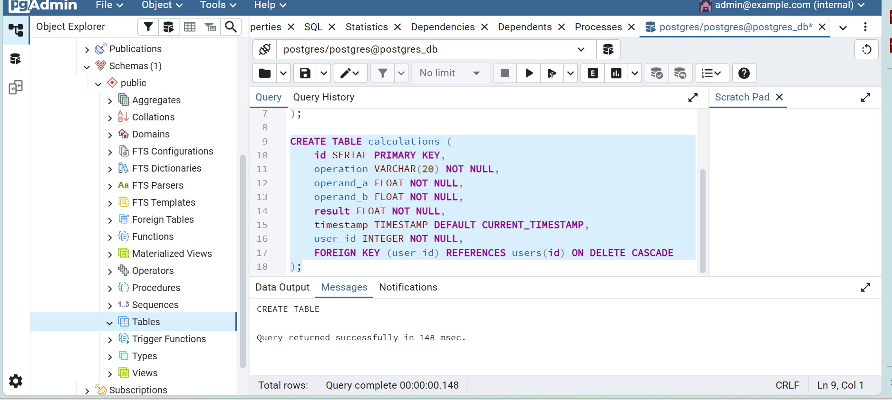
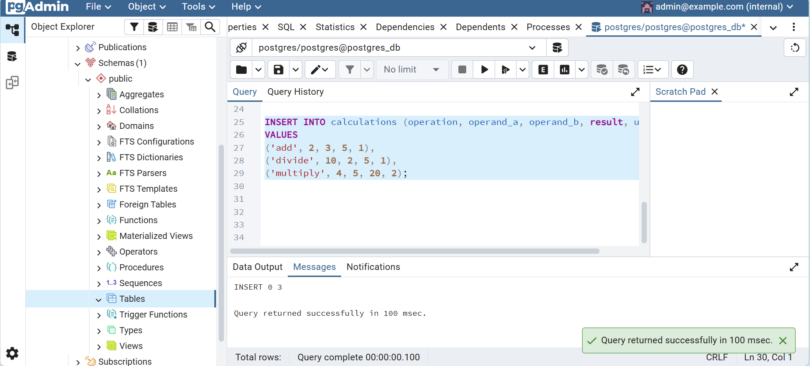
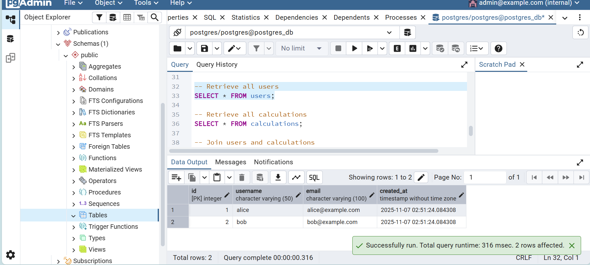
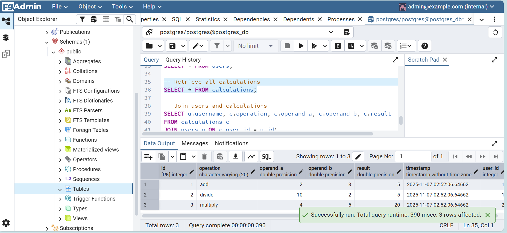
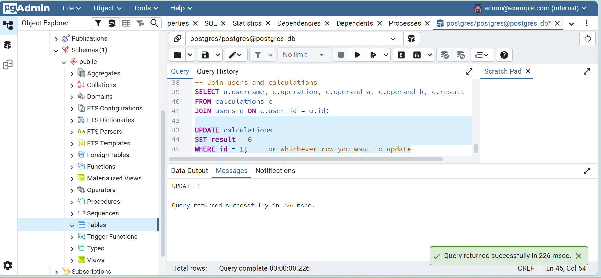
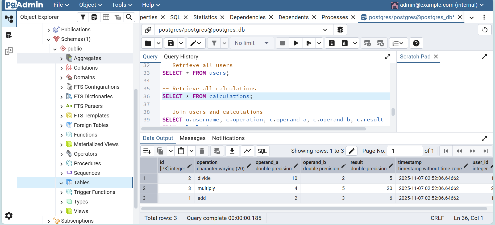
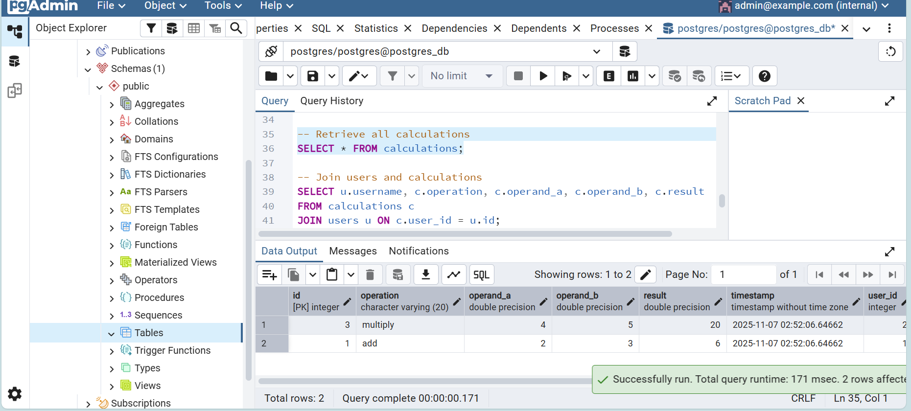

# 📦 Project Setup

# Screenshots for each query

### Creating Tables
1. 
2. 

### Inserting Records Into Tables
1. 
2. 

### Query Data
1. 
2. 
3. 

### Update A Record
1. 
2. 

### Deleting a Record From A Table
1. 
2. 

